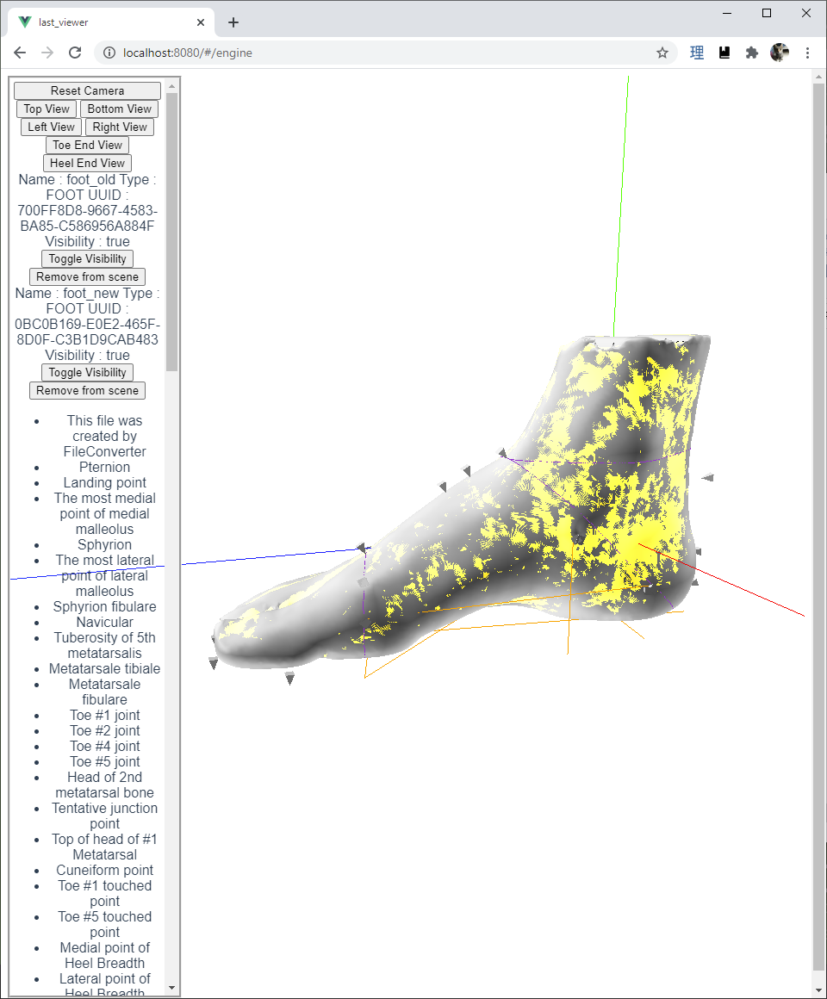

# Last Viewer

This VueJS application is a foot scan & shoe last model viewer built on ThreeJS. Its partially designed towards low-spec browsers and mobile platforms (including Android WebView).

The foot measurments supported are specified on [IWL's Foot Measurement Page](http://www.iwl.jp/content/mark_dimension.html).

The 3D model extensions that are supported are:

- OBJ's generated by IWL's FileConverter from IWL's FBD format
- STL (ASCII) files

Note:
Generic Wavefront OBJ's may work however anatomical landmarks must conform to IWL's FileConverters output to work.

If you are interested in collaboration/integration/development contact me at george.crary@iwl.jp

## Preview

Feature: Overlaying scan model over shoe last to spot differences.

Included are landmark measurment features such as ball girth circumference, heel girth circumference and instep length.



## Requirements
Vue Cli 4.5.0

## Project setup
```
npm install
```

### Compiles and hot-reloads for development
```
npm run serve
```

### Compiles and minifies for production
```
npm run build
```

### Lints and fixes files
```
npm run lint
```

### Customize configuration
See [Configuration Reference](https://cli.vuejs.org/config/).

## License

See [LICENSE.md](LICENSE.md).

Files in lib/vendor are from THREE.js or THREEx with their respective license notes.
